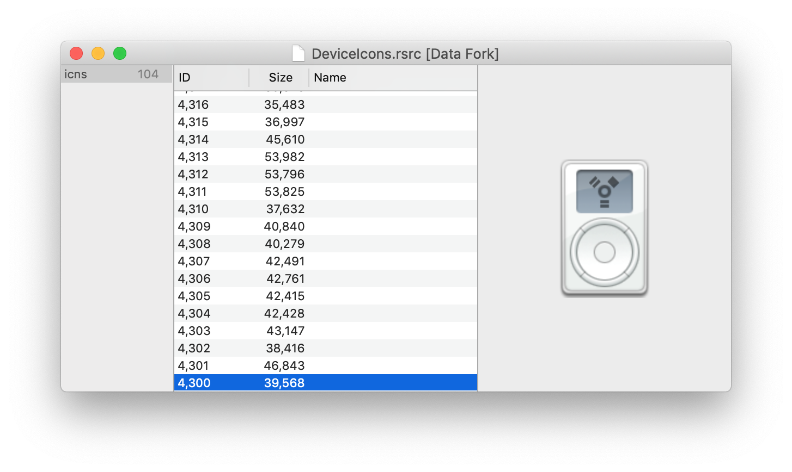
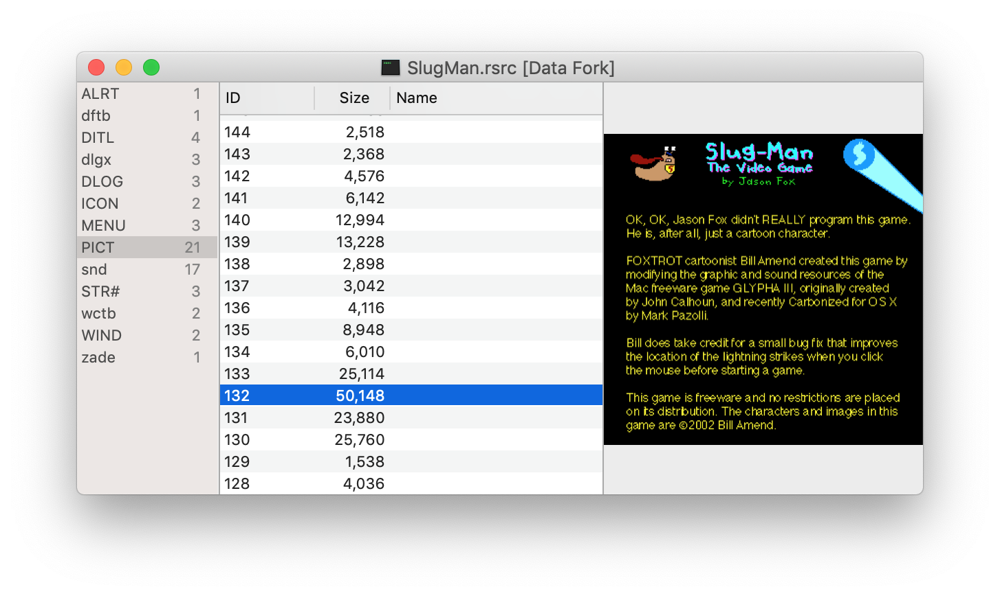

# ForkView

macOS [resource fork](https://en.wikipedia.org/wiki/Resource_fork) viewer written in Swift.

## Screenshots

Viewing the /Applications/iTunes.app/Contents/Resources/DeviceIcons.rsrc:

SlugMan resource file (game by [Bill Amend](https://www.foxtrot.com)).

## Supported Types

### Images

- `icns`
- `PICT` (unreliable, may not work in future macOS versions)
- `PNG `
- `ICON`
- `ICN#`
- `ics#`
- `CURS`
- `PAT `
- `icl4`
- `icl8`
- `kcns`
- `ics4`
- `ics8`
- `GIFF`

### Audio

- `snd ` - only mono, uncompressed

### Text

- `plst`
- `TEXT`
- `utf8`
- `utxt`
- `ut16`
- `weba`
- `RTF `
- `rtfd`
- `STR `
